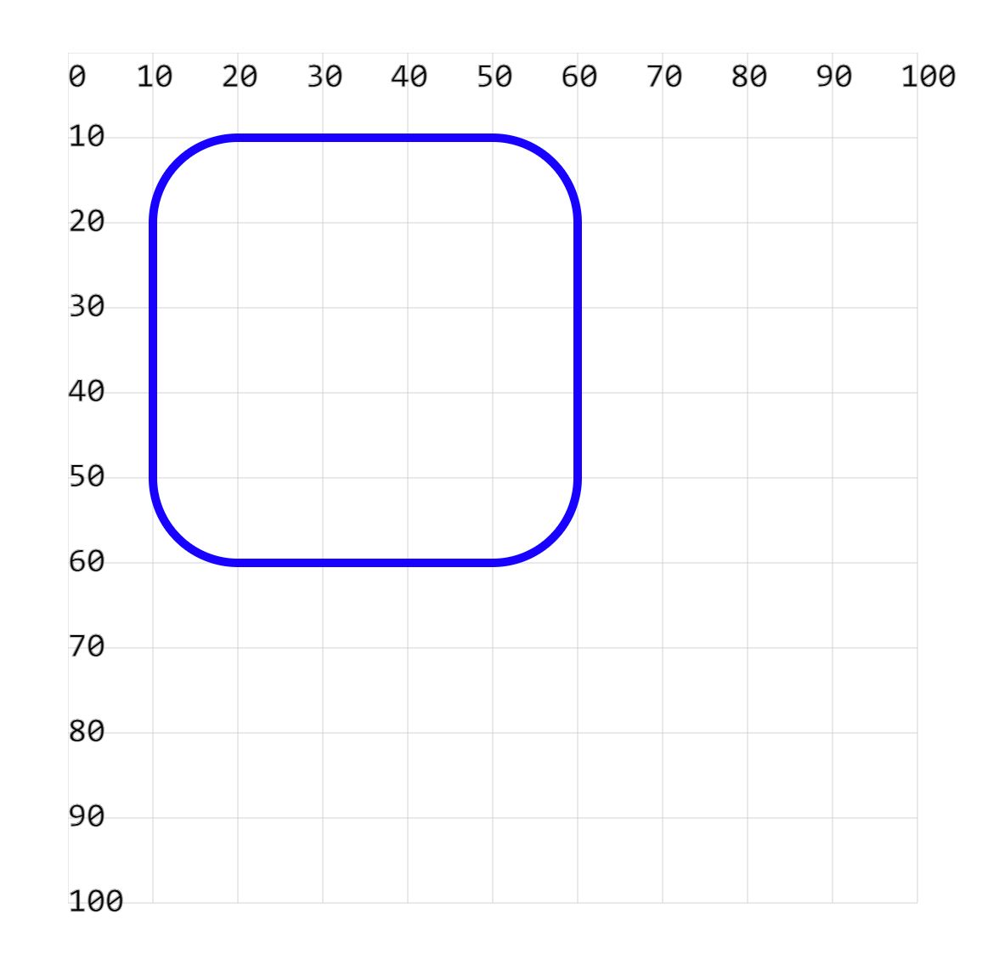

# [0008. 使用 rect 绘制矩形](https://github.com/Tdahuyou/svg/tree/main/0008.%20%E4%BD%BF%E7%94%A8%20rect%20%E7%BB%98%E5%88%B6%E7%9F%A9%E5%BD%A2)

<!-- region:toc -->
- [1. 💻 demos.1 - 绘制矩形](#1--demos1---绘制矩形)
- [2. 💻 demos.2 - 绘制圆角矩形](#2--demos2---绘制圆角矩形)
<!-- endregion:toc -->
- 绘制一个矩形，需要知道两组信息：
  1. 从哪个点开始绘制 `x`、`y`
  2. 绘制矩形的宽度和高度是多少 `width`、`height`
- 圆角
  - 通过 `rx` `ry` 可以设置矩形的圆角效果。

## 1. 💻 demos.1 - 绘制矩形

```xml
<svg style="margin: 3rem;" width="500px" height="500px" viewBox="0 0 120 120" xmlns="http://www.w3.org/2000/svg">
  <!--
  矩形默认有一个黑色的填充（背景色），可以使用 fill 和 stroke 属性设置填充颜色和边框颜色。
    比如：fill="none" 表示没有填充颜色。
    需要知道的是，所有图形都有 fill 和 stroke 属性。

  <rect x="10" y="10" width="50" height="50" />
    x="10" y="10" 设置矩形的左上角坐标，可以理解为绘制的起点。
    width="50" height="50" 设置矩形的宽和高。
    由于没有设置 fill，所以默认为黑色填充。
  -->
  <rect x="10" y="10" width="50" height="50" /> <!-- [!code highlight] -->
</svg>
```


## 2. 💻 demos.2 - 绘制圆角矩形

```xml
<svg style="margin: 3rem;" width="500px" height="500px" viewBox="0 0 120 120" xmlns="http://www.w3.org/2000/svg">
  <!--
  使用 rx 和 ry 设置圆角半径
   -->
  <rect x="10" y="10" width="50" height="50" fill="none" stroke="blue" rx="10" ry="10" /> <!-- [!code highlight] -->
</svg>
```


