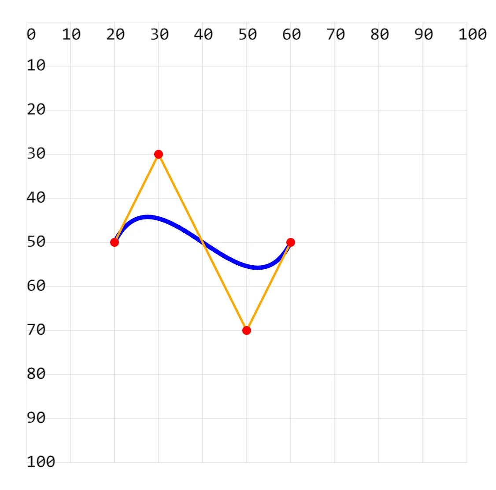
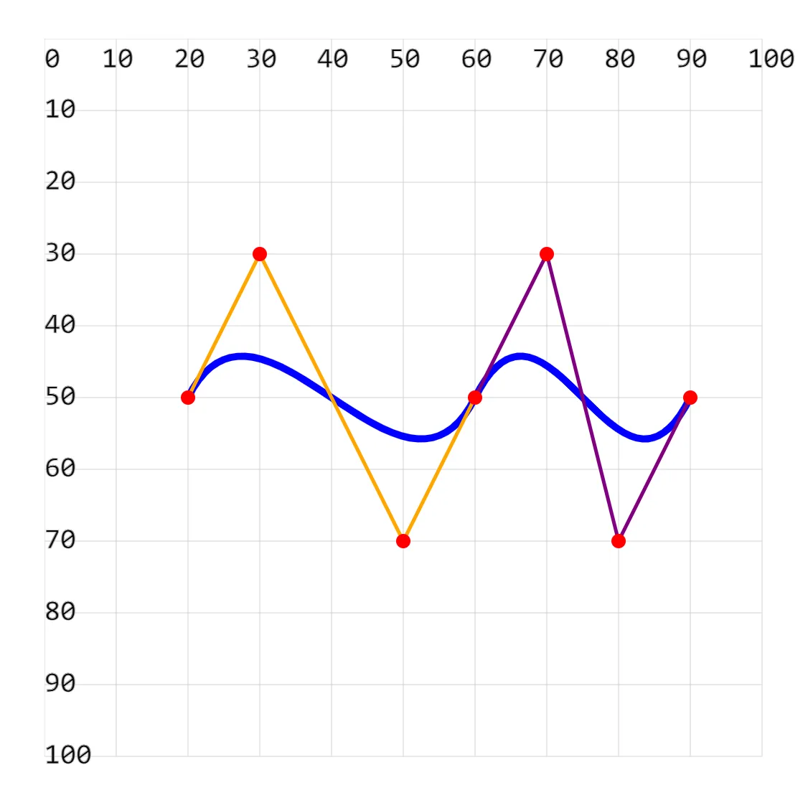

# [0014. 使用 path 绘制三次贝塞尔曲线](https://github.com/Tdahuyou/svg/tree/main/0014.%20%E4%BD%BF%E7%94%A8%20path%20%E7%BB%98%E5%88%B6%E4%B8%89%E6%AC%A1%E8%B4%9D%E5%A1%9E%E5%B0%94%E6%9B%B2%E7%BA%BF)

<!-- region:toc -->
- [1. 💻 demos.1 - C 绘制一个三次贝塞尔曲线](#1--demos1---c-绘制一个三次贝塞尔曲线)
- [2. 💻 demos.2 - C、S 绘制连续平滑的三次贝塞尔曲线](#2--demos2---cs-绘制连续平滑的三次贝塞尔曲线)
<!-- endregion:toc -->

## 1. 💻 demos.1 - C 绘制一个三次贝塞尔曲线

```xml
<!--
C 关键字的含义
  关键字 C，对应单词：cubic，表示：“立方”。
  C 的全称是 "Cubic Bézier Curve"（三次贝塞尔曲线）。
  这个命令用于绘制一个由两个控制点和一个终点定义的平滑曲线。

示例 <path d="M 20 50 C 30 30, 50 70, 60 50" fill="none" stroke="blue" stroke-width="1" />
  M 20 50
    移动到起点 (20, 50)。
  C 30 30, 50 70, 60 50
    表示从当前点（即起点）开始，绘制一条三次贝塞尔曲线到终点 (60, 50)。
    C 后面的参数 30 30, 50 70, 60 50 分别是两个控制点和终点的坐标。
-->
<svg width="110px" height="110px" xmlns="http://www.w3.org/2000/svg">

  <path d="M 20 50 C 30 30, 50 70, 60 50" fill="none" stroke="blue" stroke-width="1" />

  <!-- 辅助线 -->
  <line x1="20" y1="50" x2="30" y2="30" stroke="orange" stroke-width=".5" />
  <line x1="30" y1="30" x2="50" y2="70" stroke="orange" stroke-width=".5" />
  <line x1="60" y1="50" x2="50" y2="70" stroke="orange" stroke-width=".5" />

  <!-- 辅助点 -->
  <circle cx="20" cy="50" r="1" fill="red" />
  <circle cx="30" cy="30" r="1" fill="red" />
  <circle cx="50" cy="70" r="1" fill="red" />
  <circle cx="60" cy="50" r="1" fill="red" />
</svg>
```



## 2. 💻 demos.2 - C、S 绘制连续平滑的三次贝塞尔曲线

```xml
<!--
S 的全称是 Smooth Quadratic Bezier Curve
表示平滑二次贝塞尔曲线，用于连续绘制二次贝塞尔曲线。
和二次贝塞尔曲线中的关键字 T 类似。

S 80 70, 90 50
后面的参数定义了第二条三次贝塞尔曲线的第二个控制点和结束点。
第一个控制点不需要设置，它是上一条三次贝塞尔曲线的结束控制点的中心对称点。在这个示例中，也就是 (50, 70) 关于 (60, 50) 的对称点 (70, 30)。
-->
<svg style="" width="110px" height="110px" xmlns="http://www.w3.org/2000/svg">

  <path d="M 20 50 C 30 30, 50 70, 60 50 S 80 70, 90 50" fill="none" stroke="blue" stroke-width="1" />

  <!-- 辅助线 -->
  <line x1="20" y1="50" x2="30" y2="30" stroke="orange" stroke-width=".5" />
  <line x1="30" y1="30" x2="50" y2="70" stroke="orange" stroke-width=".5" />
  <line x1="60" y1="50" x2="50" y2="70" stroke="orange" stroke-width=".5" />

  <line x1="70" y1="30" x2="60" y2="50" stroke="purple" stroke-width=".5" />
  <line x1="70" y1="30" x2="80" y2="70" stroke="purple" stroke-width=".5" />
  <line x1="90" y1="50" x2="80" y2="70" stroke="purple" stroke-width=".5" />

  <!-- 辅助点 -->
  <circle cx="20" cy="50" r="1" fill="red" />
  <circle cx="30" cy="30" r="1" fill="red" />
  <circle cx="50" cy="70" r="1" fill="red" />
  <circle cx="60" cy="50" r="1" fill="red" />
  <circle cx="70" cy="30" r="1" fill="red" />
  <circle cx="80" cy="70" r="1" fill="red" />
  <circle cx="90" cy="50" r="1" fill="red" />
</svg>
```

