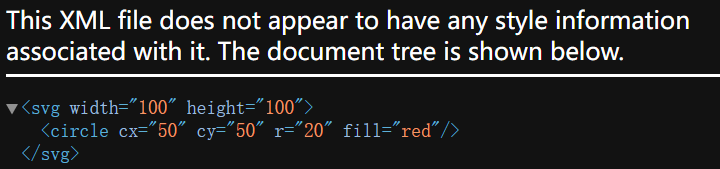
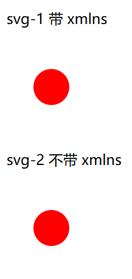

# [0046. 理解 svg 的 xmlns 属性](https://github.com/Tdahuyou/svg/tree/main/0046.%20%E7%90%86%E8%A7%A3%20svg%20%E7%9A%84%20xmlns%20%E5%B1%9E%E6%80%A7)

<!-- region:toc -->
- [1. 🔗 菜鸟教程 - xml 命名空间](#1--菜鸟教程---xml-命名空间)
- [2. 💻 demos.1 - 带有命名空间 `xmlns="http://www.w3.org/2000/svg"`](#2--demos1---带有命名空间-xmlns="httpwwww3org2000svg")
- [3. 💻 demos.2 - 不带命名空间 `xmlns="http://www.w3.org/2000/svg"`](#3--demos2---不带命名空间-xmlns="httpwwww3org2000svg")
- [4. 📒 结果分析](#4--结果分析)
- [5. 💻 demos.3 - 在 html 中嵌入 svg](#5--demos3---在-html-中嵌入-svg)
<!-- endregion:toc -->
- 本节介绍的是 xmlns，这是一个属性，用于指定 XML 文档的命名空间。它决定了 svg 文件是否能够被正常渲染，在正式开始学习 svg 的绘图规则之前，有必要了解一下 `xmlns="http://www.w3.org/2000/svg"` 这条声明的作用。
- 本节内容：模拟一个要求 - 在 100*100 的视口中，渲染一个圆心位置是 `(50, 50)`，半径是 `20` 的红色圆形，然后通过 demos 来对比带命名空间和不带命名空间的区别。

## 1. 🔗 菜鸟教程 - xml 命名空间

- https://www.runoob.com/xml/xml-namespaces.html
  - 菜鸟教程 - xml 命名空间
  - 如果不清楚 xml 命名空间是什么，可以参考这篇文章。

## 2. 💻 demos.1 - 带有命名空间 `xmlns="http://www.w3.org/2000/svg"`

```xml
<?xml version="1.0" encoding="UTF-8"?>
<svg width="100" height="100" xmlns="http://www.w3.org/2000/svg">
  <circle cx="50" cy="50" r="20" fill="red" />
</svg>
```

- 使用浏览器打开后看到的效果：
  - 
  - 可以正常渲染

## 3. 💻 demos.2 - 不带命名空间 `xmlns="http://www.w3.org/2000/svg"`

```xml
<?xml version="1.0" encoding="UTF-8"?>
<svg width="100" height="100">
  <circle cx="50" cy="50" r="20" fill="red" />
</svg>
```

- 使用浏览器打开后看到的效果：
  - 
  - 无法正常渲染

## 4. 📒 结果分析

- 在 SVG（可缩放矢量图形）中，`xmlns` 属性是命名空间声明的一部分。它告诉浏览器或任何其他解析器这个文档遵循哪个标准，并且如何解释这些标签。对于 SVG 来说，`xmlns="http://www.w3.org/2000/svg"` 声明了根元素 `<svg>` 及其子元素属于 SVG 命名空间。
- 当一个 XML 文件（包括 SVG 文件）没有正确声明其命名空间时，浏览器可能无法识别该文件中的标签为特定格式的一部分（例如 SVG）。因此，在 demos.2 中，如果不包含 `xmlns` 属性，浏览器可能会把 `<svg>` 和 `<circle>` 标签视为普通的未知标签，而不是作为 SVG 图形元素处理，所以不会应用样式或渲染图像。相反，它会显示一个默认的 XML 树结构视图。
- 一旦添加了 `xmlns` 属性，浏览器就能够识别这是一个 SVG 文档，并使用内置的 SVG 渲染引擎来正确地解析和显示图形元素。这就是为什么加上 `xmlns` 后可以正常渲染圆形的原因。

## 5. 💻 demos.3 - 在 html 中嵌入 svg

```html
<!DOCTYPE html>
<html lang="en">
  <head>
    <meta charset="UTF-8" />
    <meta name="viewport" content="width=device-width, initial-scale=1.0" />
    <title>Document</title>
  </head>
  <body>
    <div class="svg-box">
      <p>svg-1 带 xmlns</p>
      <?xml version="1.0" encoding="UTF-8"?>
      <svg width="100" height="100" xmlns="http://www.w3.org/2000/svg">
        <circle cx="50" cy="50" r="20" fill="red" />
      </svg>
    </div>
    <div class="svg-box">
      <p>svg-2 不带 xmlns</p>
      <?xml version="1.0" encoding="UTF-8"?>
      <svg width="100" height="100">
        <circle cx="50" cy="50" r="20" fill="red" />
      </svg>
    </div>
  </body>
</html>
```

- 使用浏览器打开后看到的效果：
  - 
  - 会发现两者都能正常渲染。
- 需要知道 `xmlns` 属性对于确保 SVG 内容被正确解释和渲染是非常重要的。**虽然在某些环境中（如 HTML5 文档内嵌入 SVG），可以省略 `xmlns` 属性，因为上下文已经明确了 SVG 的使用，但在独立的 SVG 文件中，最好总是包含这个属性以确保兼容性和正确的渲染。因此在编写 svg 的时候，在 svg 根元素身上都应该加上 `xmlns` 属性声明。**